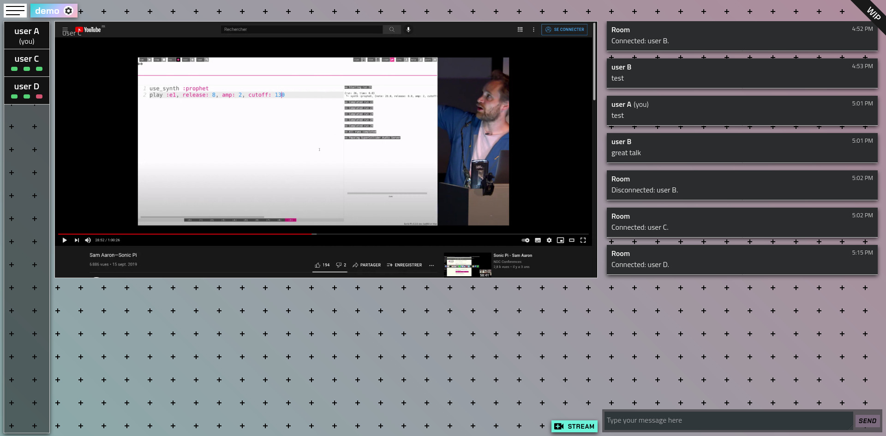
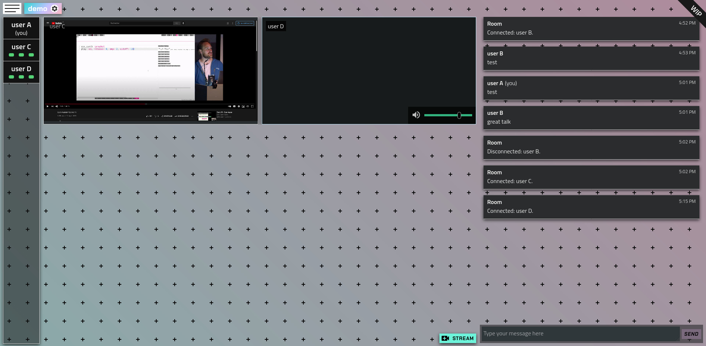

# Le Peer Chat

## About 

**Le Peer Chat** is a personal experimental project about decentralizing communications.
The application leverages the **WebRTC** technology to enable sharing textual, vocal or video data in a **peer-to-peer** manner.
As a result, paired users of the application can directly communicate with each other, without the need for their data to be relayed by a central server.  
*You can try it out on the [lepeerchat.xyz](https://www.lepeerchat.xyz) instance.*

## Features

- **No registration needed** ; only a username is asked when joining a room **for the first time**.
- **On invitation only**: a guest can join a room only via an issued invitation link.
- **Short-lived rooms**: a room is automatically discarded after **30 minutes** with no participant connected to it.
- **Re-join rooms**: a user can join back any room that is still alive (list available on the homepage).
- **Lockable rooms**: a room can be locked by its creator to prevent *new* invited guests from joining (guests that previously joined the room aren't considered "new").
- **Media sharing**: share/recieve screen and mircrophone streams from/to every participant in the room.
You can get feedback on your own stream and adjust/mute other participant's audio.
- **Textual chat**: send/recieve chat messages from/to every participant in the room.
- **UTF-8 room names and usernames**
- **Secure**: `HTTPS` by default when transmitting to the server (required by most browsers implementations of **WebRTC** anyway), `DTLS-SRTP` when transmitting to other peers.

## Captures

- 3-user room, 1 participant streaming (non-streaming point of view):

- 3-user room, 2 participants streaming (non-streaming point of view):


## Build

### Requirements

- `deno 1.14.2`
- `nodejs 15.4.0`

[asdf](https://asdf-vm.com/) can be used to install those dependencies locally (in [`server`](server) and [`client`](client) directories):
```
asdf install
```

To install needed packages:
1. for the **server** (in [`server`](server) directory):

    ```
    deno cache index.ts
    ```
2. for the **client** (in [`client`](client) directory):

    ```
    (pnpm|npm|yarn) install
    ```

### Building

> :warning: **As of deno `v1.14.2` bundling the server files yields a faulty executable ([#12086](https://github.com/denoland/deno/issues/12086)).**

The [`build.sh`](build.sh) convinience script builds both client and server applications. The built files will be located in the `build` directory.

### Running

The following **Deno** permissions are required to start the server:
- `--allow-net=:8080`: allows binding application to port `8080`
- `--allow-read=./,build/dist`: allows serving client application files

## Server

The server runs on the [deno](https://deno.land/) runtime. It is responsible for the serving of the client application, holds and manages the state of the *chat rooms* (and the connected users), and also acts as the broker server during **WebRTC** handshakes.

### HTTP routing

All the server *top-level* routing is handled by the [oak](https://github.com/oakserver/oak) middleware framework.

API routes:
- GET `/ws`: upgrades to a WebSocket connection
- GET `/static/(.*)`: returns the static files of the website
- GET `/(.*)`: serves the index file of the website

Most of the communication happens under the `/ws` route, once the connection has been upgraded to a WebSocket.

### WebSocket routing

A WebSocket [router](server/src/ws-router.ts) validates recieved messages and hands their content to the appropriate [controller](server/src/controller.ts) method.

The WebSocket router API can be found under the [interfaces](server/src/interfaces) directory.  
Each of the files under this directory describes the expected type of payload for its verb (usually homonymous with the file name).

For any WebSocket message recieved, a positive or a negative response is replied. A negative response always contains a reason.


## Client

[README.md](client/README.md)

## Limitations

At its current state (gold version), the application has quite some limitations worth pointing out:
- It lacks a **relay/TURN server**, which would help in keeping it usable for users whose connections with other peers are impossible because of their firewall blocking NAT traversal.
- It is quite resource demanding on the user device, even more so when many participants are simultaneously streaming. It might stem from the unnecessary high quality of the streams. It might also be the conseqence of the soy dev author relying too much on angular's NgZone.
- The front end isn't responsive enough for usage on smartphones.